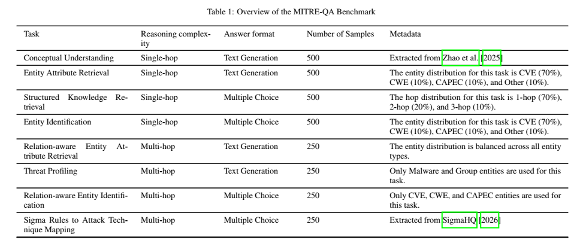

# MITRE-QA Benchmark

MITRE-QA is a cybersecurity question answering benchmark designed to evaluate large language models on structured and unstructured knowledge retrieval from cybersecurity knowledge bases.

## Overview

The benchmark integrates information from:

- MITRE ATT&CK
- MITRE CAPEC
- MITRE CWE
- NVD CVE database

  

## Tasks

### 1. Conceptual Understanding

Evaluates the ability of models to answer general conceptual and factual questions in the cybersecurity domain.

### 2. Entity Knowledge Retrieval

Evaluates the ability of models to identify specific attributes of cybersecurity entities.

### 3. Structured Knowledge Retrieval

Evaluates the ability of models to retrieve relationships among cybersecurity entities.

### 4. Entity Identification

Evaluates the ability of models to identify the target entity ID based on its associated contextual information.

### 5. Relation-Aware Entity Attribute Retrieval

Evaluates the ability of models to retrieve specific attributes of entities that are connected to a given target entity.

### 6. Threat Profiling

Evaluates the ability of models to extract comprehensive information associated with a specific group or malware entity.

### 7. Relation-Aware Entity Identification

Evaluates the ability of models to identify the target entity ID based on its relationships with other entities and its associated attributes.

### 8. Sigma Rules to Attack Techniques Mapping

Evaluates the ability of models to identify the corresponding MITRE ATT&CK techniques associated with specific Sigma rules.

## Dataset

The benchmark is provided in JSONL format.

## Prompt Templates

The prompt templates used by the multi-agent framework are available in the [`prompts/`](prompts/) directory.

- [Orchestrator Agent](prompts/orchestrator/system_prompt.md)
- [Graph Retrieval Agent](prompts/graph_retrieval/system_prompt.md)
- [Text Retrieval Agent](prompts/text_retrieval/system_prompt.md)
- [Web Retrieval Agent](prompts/web_retrieval/system_prompt.md)

## Citation

If you use MITRE-QA in your research, please cite:
